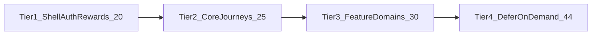

# YuLife React Native (RN client)

YuLife is a React Native mobile application for iOS and Android that provides a health and wellness platform with step tracking, challenges, rewards, and gamification features. The app uses Expo, React Native Navigation, Redux Toolkit with Sagas, Apollo GraphQL, and integrates with native health APIs.

Source control is GitLab (`glab` CLI).

## Boundaries

- **Do not modify `ios/` or `android/` directories.** This is an Expo managed project; native code changes belong in plugins or upstream packages, not in these folders directly.
- Do not add new data to the Redux store without specific user instruction.
- Do not create new barrel files. Only add to existing barrel files if needed.

## Code Rules

- File and directory names are kebab-case (e.g. `event-reward/`, `event-reward.tsx`).
- Use `import { Box } from "@atoms";` instead of `View`. Use the style props in `src/components/atoms/box/box.types.ts` instead of passing a `style` to Box.
- Do not use `Style.DEVICE_HEIGHT` or `Style.DEVICE_WIDTH` for the outermost `Box`. Use `100%` instead.
- Define components with `const` and export with `export default memo(Component)` at the bottom. Do not wrap the definition itself in `memo`.
- Destructure React imports: `property: ReactNode` not `property: React.ReactNode`. Do not use `React.FC`.
- Prop interfaces: `IComponentNameProps`.
- Screens must be rendered via a container (`screen-name.container.tsx`), never added directly to navigation.
- Modules in `src/modules/` — keep all related files within the module folder/subfolders.
- When fixing `Platform.select` returning `undefined`, add a `default` case rather than `?? fallback`.
- Use `useCallback` for callbacks passed as props to memoised children. Not required for every function in a component.
- Use `react-native-reanimated` for animations, not `Animated` from React Native.
- Use FlashList over FlatList with `estimatedItemSize`. Avoid anonymous functions in `renderItem` or event handlers.
- **All ESLint warnings are CI-blocking** (`--max-warnings 0`). When you modify a file, run `pnpm eslint <file>` and fix all warnings in that file, even pre-existing ones.
- Use `theme.colors.primary.p600` / `theme.colors.primary.p600Shadow` from `useTheme()` (`@modules/themes/hooks/useTheme`) instead of `Colours.primary.p600` / `Colours.primary.p600Shadow`.

## Environment Configuration

API URLs are controlled by `.env.local`, but `.env.local.overrides` takes precedence and will silently replace values. When pointing the app at a different API server, update `.env.local.overrides` rather than `.env.local`.

## State Management (Redux)

- Store: `src/redux/_core/store.ts`
- Async side effects via Redux-Saga, sagas in each module's directory, coordinated in `src/redux/_core/sagas.ts`

## GraphQL (Apollo Client)

- Client: `src/graphql/_core/client.ts`
- Queries by domain in `src/graphql/[feature]/`, generated types in `src/graphql/__generated/`
- Run `pnpm generate:gql:types:local` after modifying `.graphql` files
- **Never hand-edit anything under `src/graphql/__generated/`.** It is codegen output. After changing any `.graphql` file (or any server schema you depend on), always run `pnpm generate:gql:types` / `pnpm generate:gql:types:local` — do not patch the generated `graphql.ts`, `gql.ts`, `possibleTypes.ts`, or document selection sets by hand even if the API server isn't reachable. Start the API server and re-run codegen instead.

## Navigation (React Native Navigation)

Uses React Native Navigation (native stacks), not React Navigation.

- Routes: `src/navigation/routes.ts`
- Screen IDs: `src/navigation/constants.ts`
- Root layout: `src/navigation/root.ts`

## Localisation (Tolgee)

- New copy goes in `en-GB.json` only — CI handles other languages.
- API: `src/locale/index.ts`, wrapper: `src/locale/translator.ts`

## Unit Tests (Jest)

- Runner: Jest (`jest.config.ts`)
- Run all: `pnpm test:unit`
- Run single file: `pnpm jest path/to/file.test.ts`
- Tests are co-located with source as `filename.test.ts` — no `__tests__/` directories.

## E2E Testing (Detox)

Test structure: `e2e/feature/sub-feature/*.spec.ts`

- Uses `@yu-life/yulife-bdd-framework` for BDD-style tests: `Feature()` > `Scenario()` > `Given()` / `When()` / `Then()`
- Step definitions in `_steps/given.ts`, `_steps/when.ts`, `_steps/then.ts`
- Prefer seed helpers (`createCustomerRecords()`, `createBusinessRecords()`) over seeding individual models
- Separate users for each Scenario — do not share customer/user data between Scenario blocks
- Businesses can be reused across scenarios

**Running E2E Tests**:

1. Backend: In api-server repo, run `pnpm detox:start` (request the user to do this separately)
2. Terminal 1: `pnpm start:e2e` (bundler + TypeScript watch)
3. Terminal 2: `CI=true pnpm detox:run e2e/path/to/suite.spec.ts`

**Troubleshooting**:

- "Failed to find the app binary": run `pnpm detox:build`
- "Failed to find a device by type": check `xcrun simctl list devices available | grep -i iphone`, then `xcrun simctl create "iPhone 16 Pro" "iPhone 16 Pro"`

---

# CLAUDE.md — Component Library Rebuild & Storybook

> Component library rebuild, Storybook documentation, and LLM-optimised reference docs. **Storybook IA:** `packages/yulife-design-system/guidelines/storybook-ia.md`.

---

## Project Context

YuLife mobile app — React Native 0.79.6 / React 19 / Expo bare workflow.
Navigation: `react-native-navigation` (Wix), NOT React Navigation.
State: Redux + Redux Saga + `@apollo/client` for GraphQL.
Styling: custom `StyleSheet` wrapper from `@styles` — not Tailwind, not styled-components.
Theming: `useTheme()` hook returns `MobileGameTheme` with `theme.colors.primary.p600`, etc.
Translations: Tolgee + `node-polyglot` via a `t()` function.
Package manager: pnpm (v10). Always use `pnpm`, never `npm` or `yarn`.

## Current Task

We are rebuilding the component library and Storybook from scratch. Progress:

1. **Audit** — identify and remove unused components, consolidate duplicates *(ongoing)*
2. **Reorganise** — replace atomic design with a flat, purpose-based IA *(done — see Storybook IA below)*
3. **Document** — web Storybook with design-system components and app screens *(in progress — 56+ legacy components + Journey DS merge + 4 templates + 10/129 screens)*
4. **Optimise for LLMs** — machine-readable Storybook and reference docs *(in progress)*

**Journey design-system merge:** Canonical components from `~/Projects/design-system` are tracked in `packages/yulife-design-system/guidelines/merge-manifest.json`. Merged so far: Figma-canonical `Button`, templates (`SinglePageTemplate`, `ModalTemplate`, `YuCoinScreen`, `QuestScreen`), Foundations token stories, and supporting components (Hero, Card, Tile, NavigationHeader, ActionBar, etc.). Reference page: `Screens/Examples/Health Cash Plan`.

Full screen inventory and documentation status: `screens/screen-catalog.json`. Priority tiers below.

Design-system components live in `packages/yulife-design-system` and are imported as `@yulife-private/design-system`. The main app still uses legacy `src/components/atoms|molecules|organisms/` path aliases during migration.

## Component Architecture (CURRENT — being replaced)

```
src/components/
├── atoms/            # Primitives
├── molecules/        # Composed atoms
├── organisms/        # Larger sections
├── containers/       # Redux/Apollo-connected wrappers
├── screens/          # Full screens
├── modals/           # Modal screens
├── games/            # Gamification components
├── sdui/             # Server-driven UI
└── sdui-sections/    # SDUI sections
```

The app source still uses this layout. Storybook sidebar categories are **decoupled** from these folders — see [Storybook IA](#storybook-ia-canonical) below.

## Storybook IA (canonical)

**Source of truth:** `packages/yulife-design-system/guidelines/storybook-ia.md`

Storybook uses a flat, purpose-based IA (max two sidebar levels: `{Category}/{ComponentName}`). Do not use atomic-design category names in story titles.

| Category | Purpose |
|---|---|
| `Layout` | Structure, surfaces, composed content blocks (`Box`, `Card`, battle pass, activity panels) |
| `Typography` | Text rendering and copy patterns (`Text`, `HeadingAndCopy`, `Hyperlink`) |
| `Inputs` | Interactive controls and form fields (`Button`, `TextField`, `Switch`, health provider pickers) |
| `Media` | Images, icons, avatars, AV player presentation |
| `Navigation` | Headers, tabs, settings dividers, navigational list rows |
| `Feedback` | Loading, progress, toasts, skeletons, notifications, info callouts |
| `Screens` | Full app screens — title format `Screens/{Domain}/{ScreenName}` |

**Title rules:** Use the **exported component name**, not the source folder (e.g. `Inputs/TextField`, not `Inputs/TextInput`). Variant exports share one story (e.g. `Button`, `SecondaryButton` → `Inputs/Button`).

**Reference docs** (design system): `packages/yulife-design-system/guidelines/` — `storybook-ia.md`, `components.md`, `tokens.md`, `overview.md`.

## Path Aliases

Defined in `tsconfig.json`. Must also be aliased in Storybook webpack config.

- `@styles` → `src/styles`
- `@atoms` → `src/components/atoms`
- `@molecules` → `src/components/molecules`
- `@organisms` → `src/components/organisms`
- `@hooks` → `src/hooks`
- `@modules` → `src/modules`
- `@services` → `src/services`
- `@app` → `src`
- `@ids` → test ID helpers (check tsconfig.json for exact path)

**After the IA redesign:** path aliases will change. Update `tsconfig.json` paths, Storybook webpack aliases, and all imports across the codebase in lockstep.

## Styling Conventions

- All styles use `StyleSheet.create()` from `@styles` (custom wrapper, not from react-native directly).
- Responsive sizing: `Style.adjust(value)` — a device-width-based scaling function.
- Colours: `Colours.neutral.white`, `Colours.overlay.white50`, etc. from `@styles`.
- Media queries: `media.select()` custom helper.
- Fonts: Bariol (Bold, Light, Regular), OpenSans (Bold, Light, Regular).
- Do NOT use inline styles. Follow the pattern: `const styles = StyleSheet.create({})` at the bottom of each file.

## Theming

- Access: `const { theme } = useTheme()` from `@modules/themes/hooks/useTheme`.
- Type: `MobileGameTheme` from `@app/modules/themes/types`.
- Primary: `theme.colors.primary.p600`.
- Shadow: `theme.colors.primary.p600Shadow`.
- Must be provided in Storybook via a global decorator.

## Storybook Setup

- **Type:** Web-based, rendering RN components via `react-native-web`
- **Target version:** Storybook 10.x with `@storybook/react-webpack5`
- **Package:** `@yulife-private/design-system` in `packages/yulife-design-system/`
- **Story format:** CSF3 exclusively. No `storiesOf` API.
- **Story locations:**
  - Design-system components: `packages/yulife-design-system/src/**/*.stories.tsx`
  - App screens: `screens/**/*.stories.tsx`
- **Config:** `.storybook/main.ts`
- **Run:** `pnpm start:storybook:web` (http://localhost:6006)

---

## App Screen Stories

**Inventory:** `screens/screen-catalog.json` — 128 app screens total, 9 documented, 119 pending.

### Progress

**Done (9)** — all five bottom-tab roots plus auth and system screens:

| Domain | Screen |
|---|---|
| Auth | `LoginEmail` |
| System | `GenericError`, `NoAccess`, `Offline` |
| Member | `DailySteps`, `QuestMap`, `YuScreen`, `Leaderboard`, `Shopfront` |

**Remaining:** 119. **Practical target:** ~54 screens (Tiers 1–2) for strong LLM coverage; documenting all 128 is not required for launch.

### Screen story conventions

| Concern | Location |
|---|---|
| Meta helper | `screens/_utils/screen-meta.ts` — `createScreenMeta`, sets `parameters.screenStory: true` |
| Mock fixtures | `screens/_fixtures/` |
| Mock actions | `screens/_utils/mock-actions.ts` |
| Redux preloads | `.storybook/story-store.ts` |
| Props-only example | `screens/member/shopfront.stories.tsx` |
| Shell + connected example | `screens/member/daily-steps.stories.tsx` (Phase 1 shell, Phase 2 with Redux) |

**Execution rules:**

1. Import the **presentational** `.screen.tsx`, not the container.
2. Prefer prop-driven screens first; use loading/shell variants when a screen reads Redux internally (DailySteps Phase 1 pattern).
3. Reuse fixtures across related screens (hero cards → EventDialog; shopfront mocks → RewardsList).
4. Loading-only screens (`*Loading`) → story variants on the parent, not separate catalog entries.
5. After adding a story, update `storyPath` and `storyStatus: "documented"` in `screens/screen-catalog.json`.

### Priority tiers



#### Tier 1 — Next 20 (shell + auth + rewards)

| Screen | Rationale |
|---|---|
| Menu | Side drawer; fully prop-driven |
| Settings | High-traffic menu destination |
| ChallengesList | Quest tab drill-down (gap after QuestMap) |
| Notifications | Top-bar on every tab |
| LoginPassword, LoginConfirm | Complete auth funnel |
| LoginHero | Pre-auth landing (Apollo mock) |
| ResetPassword, EmailSent | Auth recovery |
| RewardsList, RewardsPurchased, RewardsUnavailable | Rewards tab completeness |
| BattlePass | Second Rewards tab view |
| TodayEarnings | YuCoin explanation |
| Permissions | Onboarding/settings gate |
| Referrals | E2E-heavy growth flow |
| ActivityHistory | Menu destination |
| LeaderboardSettings | Leaderboard tab settings |
| Tools | Menu tools hub |
| Achievements | Gamification summary |

#### Tier 2 — Core journeys (25)

- **Challenge/quest loop (10):** EventDialog, ChallengeDetails, ChallengeProgress, ChallengeSuccess, ChallengeFailed, ChallengeExit, ChallengeUnavailable, LevelLocked, ChallengesHistoryNew, CollectReward
- **Streaks & onboarding (4):** Streaks, SignupReward, FitkitConnect, Feedback
- **Leaderboard & social (3):** UserSearch, ActiveDuels, Duels.intro
- **Health (2):** YuHealthConnect, YuHealthConnectSelect
- **System & misc (6):** Splash, Update, Generic, Info, Inspect — cover EventDialogLoading as a variant on EventDialog, not a separate story

Redux-in-screen components (`ChallengeSuccess`, `Streaks`) need a preloaded store or shell args.

#### Tier 3 — Feature domains (30)

Batch by domain to reuse fixtures:

- **Gifting (9+1):** all `Gifting*` screens + GiftView
- **Smoking (3):** SmokingHub, SmokingCommitment, SmokingStreakLapsed
- **Pathways (10):** Pathways + all pathways sub-screens in the catalog
- **Battle pass & tournaments (6):** BattlePassIntro, BattlePassLeaderboard, TournamentDetails, TournamentTeams, TournamentHowToPlay, CollectEventReward
- **Products & perks (4):** ProductDetails, Beneficiary, PerkSubscriptionInfo, AppReview

#### Tier 4 — Defer or skip (~44)

- **Debug:** Debug, LevelSelector, PathwaysProgress, TournamentDebug
- **Legacy duplicates:** ChallengeFailedOld, ChallengeSuccessOld, PermissionsOld, Login (legacy)
- **Games:** Sudoku (7 screens)
- **Media/AV:** MediaPlayer, MediaPlayerProgress, FiitMediaList, FiitMediaCategoryList, MeditopiaMediaList, MeditopiaMediaAll
- **Seasonal/SDUI:** Wrapped (7 stages), Sdui, WebView
- **Loading-only and modal overlays:** cover as variants on parent stories

Each screen's `priorityTier` in `screens/screen-catalog.json` mirrors this ordering (`1`–`4`, `skip`, or `done`).

### Suggested next 5

When picking up screen story work, start here:

1. Menu
2. ChallengesList
3. Settings
4. LoginPassword
5. LoginConfirm

---

## Component Audit Rules

When analysing components for the audit:

### Counting imports
- An "import" means the component is referenced by another file in `src/` **outside its own directory**.
- Internal imports (e.g. `button.base.tsx` importing from `button.types.ts`) don't count.
- Re-exports through barrel files (index.ts) DO count if the barrel is imported elsewhere.

### Identifying dead code
- 0 external imports = candidate for removal.
- Also check for dynamic references: SDUI component registries, navigation screen registration files, and `require()` calls.

### Identifying duplicates
- Look for same-purpose components with different names or slight API variations.
- Look for wrapper components that add no logic — they just forward props.
- Look for components that are 90%+ identical JSX with minor style differences.

### Recommendations
- KEEP = actively used, no issues.
- REMOVE = 0 imports, no dynamic references, safe to delete.
- CONSOLIDATE = merge into another component (specify which).
- REFACTOR = keep but split, simplify, or redesign (specify why).

---

## Story Writing Conventions

### Purpose

Every story file serves two audiences:
1. **Human developers** browsing Storybook in a browser
2. **LLMs** reading the raw `.stories.tsx` source files or the generated reference docs

Write for both. Be explicit. Don't assume context.

### Meta block (required fields)

```tsx
import type { Meta, StoryObj } from "@storybook/react-webpack5";
import { ComponentName } from "./component-name";

const meta: Meta<typeof ComponentName> = {
  // Title uses the NEW IA category, not the old atomic level — see storybook-ia.md
  title: "Inputs/Button",  // or "Layout/Card", "Feedback/Toast", "Screens/Auth/LoginEmail", etc.

  component: ComponentName,

  tags: ["autodocs"],

  parameters: {
    docs: {
      description: {
        // REQUIRED: plain English description for humans AND LLMs
        component: [
          "Primary interactive button with press animation and theme support.",
          "",
          "**When to use:** Any user-initiated action — form submission, navigation, confirmation.",
          "**When NOT to use:** Inline text links (use `TextLink` instead), icon-only actions (use `IconButton`).",
          "",
          "**Commonly used with:** `ScreenShell`, `FormScreen`, `ModalShell`.",
          "**Theme-aware:** Yes — background and shadow colours come from the active theme.",
        ].join("\n"),
      },
    },
  },

  argTypes: {
    // REQUIRED: every public prop with description and control
    size: {
      control: "select",
      options: ["Fill", "ExtraSmall", "Small", "Medium", "Large", "Narrow", "Coin"],
      description: "Controls width and height. 'Fill' stretches to parent width. 'Large' is the default for primary actions.",
    },
    disabled: {
      control: "boolean",
      description: "Prevents press interaction and applies a muted overlay to the background colour.",
    },
    isLoading: {
      control: "boolean",
      description: "Replaces the title with an ActivityIndicator. Press events are suppressed while loading.",
    },
    // ... etc for every prop
  },
};

export default meta;
type Story = StoryObj<typeof ComponentName>;
```

### Required stories per component

| Story name | When to include | Purpose |
|---|---|---|
| `Default` | Always | Most common usage — this is what an LLM should generate by default |
| `AllVariants` | When the component has an enum prop (size, variant, status) | Shows every option in a grid/list |
| `Disabled` | When the component supports `disabled` | Shows the disabled visual state |
| `Loading` | When the component supports `isLoading` | Shows the loading visual state |
| `WithContent` | When the component has children/slots | Shows realistic composed usage |
| `Playground` | Always | All controls enabled, no hardcoded args — for interactive exploration |

### LLM-critical rules

1. **Descriptions must be self-contained.** Don't write "see the design system for details" — include the details. An LLM can't follow links.

2. **Prop descriptions must include constraints.** Not just "The button label" but "The button label. Required unless `children` is provided. Max ~30 characters recommended for `Small` size."

3. **Show composition in code.** If a component is commonly used inside another, include a `Composition` story with a code comment explaining the parent-child relationship.

4. **Use realistic mock data.** Don't use "Lorem ipsum" or "Test". Use data that looks like it belongs in the YuLife app: challenge names, reward descriptions, step counts, dates.

5. **Document theme behaviour.** If a component's appearance changes with the theme, add a comment or story showing it in both the default and an alternative theme.

6. **Name stories descriptively.** `WithLeftIconAndBadge` is better than `Variant3`. An LLM uses the story name to understand what it shows.

---

## LLM Reference Layer

Reference documents for LLM consumption live in `packages/yulife-design-system/guidelines/`. Additional generated indexes may go in `docs/llm-reference/` when created.

**Read first:** `storybook-ia.md` (category map), `components.md` (props and examples), `tokens.md` (design tokens).

### component-index.md / component-index.json

Flat lookup table with one entry per component:

```json
{
  "name": "Button",
  "category": "Inputs",
  "path": "packages/yulife-design-system/src/components/button/button.tsx",
  "storyPath": "packages/yulife-design-system/src/components/button/button.stories.tsx",
  "description": "Primary interactive button with press animation and theme support.",
  "props": ["label", "variant", "size", "disabled", "isLoading", "onClick", "leftIcon", "rightIcon"],
  "themeAware": true,
  "translationKeys": false,
  "usedBy": ["JoinLeaderboard", "GiftSendPrompt", "CodeAndLinkCopy"]
}
```

### design-tokens.md

See `packages/yulife-design-system/guidelines/tokens.md` for the full token reference. When generating standalone LLM docs, dump ALL values, not just names:

```
## Colours

### Neutral
- white: #FFFFFF
- black: #000000
- ...

### Primary (from theme)
- p600: varies by theme (default: #E30D76)
- p600Shadow: varies by theme

## Typography

### Text templates (TemplateTextType)
- b2b: Bariol Bold, 16px (Style.adjust(16))
- l1b: Bariol Bold, 12px (Style.adjust(12))
- ...

## Spacing
- Style.adjust(4) = 4 * scaleFactor
- Style.adjust(8) = 8 * scaleFactor
- ...
```

An LLM needs the concrete values to generate visually correct output.

### patterns.md

For each common pattern, include:
1. A plain English description
2. Which components are composed
3. A code snippet showing the composition
4. Any props that must be set for the pattern to work

### constraints.md

Hard rules for LLM-generated code:
- Import StyleSheet from `@styles`, not `react-native`
- Use `Style.adjust()` for all spacing and sizing
- Use `Colours` from `@styles` for all colour values
- Use `useTheme()` for theme-dependent colours
- Use `t('key')` for all user-facing strings
- Never use inline styles
- Navigation uses `react-native-navigation` (Wix), not React Navigation
- Always provide `testID` props for interactive elements
- Always provide `accessibilityLabel` and `accessibilityRole`

---

## Native Module Stubs

For Storybook web rendering, these need no-op stubs:

| Module | Stub approach |
|---|---|
| `react-native-navigation` | Object with no-op methods (`push`, `pop`, `showModal`, etc.) |
| `@yu-life/react-native-fitkit` | Empty export |
| `@yu-life/react-native-yu-watch` | Empty export |
| `@yu-life/react-native-yu-health` | Empty export |
| `react-native-google-cast` | Empty export |
| `rive-react-native` | Stub component that renders a placeholder `<View>` |
| `react-native-in-app-review` | `{ RequestInAppReview: () => Promise.resolve() }` |
| `expo-haptics` | `{ impactAsync: () => {}, selectionAsync: () => {} }` |
| `react-native-config` | Proxy to `process.env` via webpack DefinePlugin |
| `clevertap-react-native` | Empty export |
| `customerio-reactnative` | Empty export |
| `@datadog/mobile-react-native` | Empty export |
| `mixpanel-react-native` | `{ Mixpanel: class with no-op track/identify/reset }` |
| `@bugsnag/expo` | `{ start: () => {}, notify: () => {}, leaveBreadcrumb: () => {} }` |
| `react-native-encrypted-storage` | In-memory key-value store matching AsyncStorage interface |

Place all stubs in `web/stubs/` and alias in `.storybook/main.ts` webpack config.

---

## Do NOT

- Do NOT use React Navigation APIs — this app uses Wix react-native-navigation
- Do NOT import StyleSheet from `react-native` — use the `@styles` wrapper
- Do NOT hardcode colours — use `Colours` from `@styles` or `theme.colors`
- Do NOT skip the ThemeProvider decorator — components using `useTheme()` will crash
- Do NOT use `npm` or `yarn` — use `pnpm`
- Do NOT place stories in a separate directory — co-locate them with the component
- Do NOT use `storiesOf` API — CSF3 only
- Do NOT use "Lorem ipsum" in stories — use realistic YuLife content
- Do NOT create the old atomic design categories (atoms/molecules/organisms) in Storybook titles — use the IA in `storybook-ia.md`
- Do NOT remove components without confirming against the audit report
- Do NOT move components without running `pnpm tsc` after each batch
