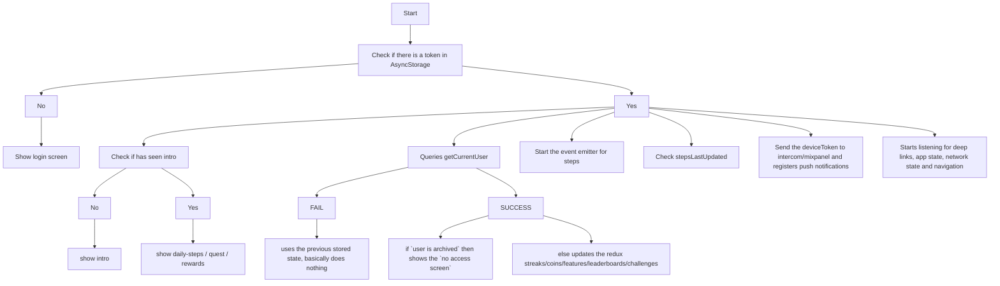

# yulife app

Source code for the React Native app for iOS and Android.

## Project Installation

### Node.js

The required version of Node.js is managed through [nvm](https://github.com/creationix/nvm). To ensure you're running the correct version of Node.js, follow the [nvm installation instructions](https://github.com/creationix/nvm#installation), then run the following command:

```sh
nvm use
```

### React Native

Follow the [React Native Installation Instructions](https://reactnative.dev/docs/environment-setup) for both iOS and Android targets, skipping the section that installs Node.js. This should guide you through the installation of the following required components:

- watchman
- react-native-cli
- XCode (v14.2 or newer)
- XCode Command Line Tools
- Java Development Kit (JDK 17)
- Android Studio
- Android SDK

If you are having trouble starting the apps, ensure you have followed the installation instructions correctly and have installed all of the necessary dependencies.

### Ruby

Required version of ruby is handled through [rbenv](https://github.com/rbenv/rbenv) To ensure you are running correct ruby version defined in support/ios/.ruby-version config, follow [installing ruby versions](https://github.com/rbenv/rbenv#installing-ruby-versions). Example if .ruby-version contains 3.2.2:

```
brew install rbenv
rbenv install 3.2.2
rbenv global 3.2.2
ruby -v
```

Configure your shell to load rbenv: [setting up shell](https://github.com/rbenv/rbenv#basic-git-checkout)

## Prepare app for building

### Install app dependencies

This project uses `pnpm` for project tasks and dependencies.

Before you run `pnpm install` make sure you have added your [Gitlab token:](https://yulife.atlassian.net/wiki/spaces/ENGINEERIN/pages/1141833734/Engineering+setup+-+gitlab+access+tokens)

To install dependencies, run:

```sh
pnpm install
```

To generate the native projects:

```sh
pnpm regenerate
```

To install the much needed ruby gems:

```sh
cd ios && bundle install && cd ..
```

You'll also need to install iOS pods by running

```sh
pnpm pod:install
```

If running `pod:install` produces the error `SDK "iphoneos" cannot be located`, this means the XCode installation path is incorrect (it's probably installed under "Applications").

You can check this by running

```sh
sudo xcode-select --print-path
```

To update this path use

```su
sudo xcode-select --switch /Applications/Xcode.app
```

If you can no longer use git in your terminal, you need to reapprove the Xcode licence, do that with

```su
sudo xcodebuild -license

```

### Returning to the project after some time

If you’re revisiting the project after a while and encountering issues, it’s a good idea to run the following command:

```su
pnpm update
```

This ensures that all dependencies are updated, installed, or removed as needed for the project to run smoothly.

### Download Apollo Schema and generate types

This project uses Apollo/GraphQL for its backend communication.

To download the latest backend schema from the deployed API develop server, and generate types run:

```sh
pnpm generate:gql:types
```

Alternatively, if you are developing against a local instance of the API server, you can download its schema by running:

```sh
pnpm generate:gql:types:local
```

### Download the Translation files

This project uses tolgee for its localisation.

To download the latest version of the translations, run:

```sh
pnpm translations:download:local
```

### Start bundler and TypeScript watch process

The Metro bundler and TypeScript watch process must be started before you can build and run either app. Start these with the following command:

```sh
pnpm start
```

### Optimising new image assets

When new image assets are added, these should be run through [ImageOptim](https://imageoptim.com) to reduce the file size as much as possible without a loss in quality.

## Build app

#### Local environment override

To create local environment values override create a file in root directory `.env.local.overrides`
When running `start:{ios|android}:local` an `.env.local` file will be generated merging `.env` and `.env.local.overrides` files.

### iOS

Building the app using XCode is the only way to install a development build on a physical device. If you only need to develop using the simulator you can use the command line.

#### Building from command line

Build and run the app in the default simulator by running the following command:

```sh
pnpm start:ios
```

This will run under the default build profile, which will connect to the development API server. To choose a different build profile, add the profile name to the previous command, as below:

```sh
pnpm start:ios:{profile}
# config = local | uat | production
```

#### Building from XCode

You should have installed XCode during the React Native installation process as described above.

The XCode project file can be opened either from within XCode or from Finder directly. It can be found:

```sh
<project directory>/ios/YuLife.xcodeproj
```

To build the app, select your preferred simulator target from the drop-down (this can include a physical device if one is connected) then press the Play button.

##### Build profiles (iOS)

Choose your build profile from the `Product -> Scheme` menu. By default, the `YuLife` profile is selected which connects to the develop API server. Alternate profiles available are `local`, which will connect to a local API instance, `uat` and `production`.

##### App signing

The app needs to be signed before it can be installed on a physical device.

- Ensure you've logged in to XCode using your Apple ID (`Preferences -> Accounts`). Your account needs to be linked to the `Yu Life Limited` team.

- Under the _General_ tab of `YuLife` build target, tick the `Automatically manage signing` option and select `Yu Life Limited` as your team.

#### Troubleshooting

##### `start:bundler` is failing

Sample error message:

```
warn Package react-native-navigation contains invalid configuration: "dependency.assets" is not allowed...
```

Solution:

```
rm -rf node_modules ios/Pods
nvm use 18
pnpm install
npx pod-install
nvm use 14
pnpm start
```

##### Building

If building from GUI doesn't work, you can try building from the CLI using the following command

```
pnpm react-native run-ios --simulator="iPhone 12 mini"
```

Or more generally

```
pnpm react-native run-ios --simulator=<SIMULATOR>
```

### Android

#### Building from command line (Android)

Ensure that the Java SDK (JDK) home path is set as an environment variable called `JAVA_HOME` for the shell used to start the Android build process. You can find the path out by running:

```sh
/usr/libexec/java_home -V | grep jdk
```

Build and run the app in the default simulator by running the following command:

```sh
pnpm start:android
```

##### Error: Not Enough Space

If you encounter an error relating to "not enough space", you may need to increase the size of the emulator's virtual disk. To do this, open Android Studio, then:

- Open the "Device Manager".
- Select your chosen emulator and click the pencil icon to edit it.
- Click the "Show Advanced Settings" button.
- Increase the "Internal Storage" and "SD Card" values to `4098MB`.

This error occurs because the default internal storage value of 2GB is not enough for modern Android versions.

##### Slow/Sluggish Performance

If you notice the Android emulator is running slowly, you can try increasing the amount of RAM it has access to. By default, Android Studio has a maximum heap size of 1280MB. Try increasing this to `2048MB` or more, by following the instructions [here](https://developer.android.com/studio/intro/studio-config#adjusting_heap_size).

### Android Physical device

To run the app locally on a physical device, you need:

- Android 5.0 (Lollipop) or newer,
- USB debugging enabled (in Developer Settings),
- a USB connecting your mobile device to your computer.

#### 🔗 Connecting to your Local API

Don’t Use Your Mac’s IP! Use adb reverse Instead
`adb reverse` forwards traffic from your phone back to your Mac. This makes localhost on your phone point to your Mac instead.

Forward API Requests

```
adb reverse tcp:5000 tcp:5000
```

Now, you can use `http://localhost:5000/graphql` as your API endpoint.

#### 📡 Setting Up Wireless ADB (optional)

- Plug your phone in via USB and run this to make your phone listen for ADB connections on port 5555:

```
adb tcpip 5555
```

- Go to Settings → About → Status to get your phone’s IP.
- Connect to your phone using:

```
adb connect <your-ip>:5555
```

You now have a wireless ADB connection!

💡 If you go out of range and return, just run the connect command again. As long as your phone hasn’t restarted, it will reconnect instantly.

#### Building from Android Studio

You should have installed Android Studio during the React Native installation process as described above.

If you're opening Android Studio for the first time, select `Open and existing Android Studio project` from the Welcome screen and choose the following directory:

```sh
<project directory>/android
```

Wait patiently for the project to sync all of its dependencies. Once it's up-to-date, you can build the app by pressing the Play button from the top menu or selecting `Run -> Run 'app'` from the menu. At this point the ADB window will appear for you to select your deployment target. Either choose a connected phsyical device or any simulator you may have configured.

##### Build profiles (Android)

Choose your build profile from the `Build Profile` menu, which can be found as a vertical tab on the left side of Android Studio's window. By default, the `debug` profile is selected which connects to the develop API server. Alternate profiles available are `local`, which will connect to a local API instance, `uat` and `production`.

##### Error: `Corrupted DataBlock found in cache` (Android)

This error may be fixed by killing all Gradle daemon processes with `pkill -f '.*GradleDaemon.*'`. When that's done, restart the project.

#### How to import Hardware Profiles to Android Studio

You will find all the `hardware-profiles` of the most android devices used by our users on `android-hardware-profiles`

Open `Android Studio` > `AVD Manager` > `Create Virtual Device Configuration` > `Import Hardware Profiles`

#### Google Account signing

In order to sign-in using a Google Account on your local development build, you need to link your local build to an OAuth client ID. To do this, you will first need to open the Android project in Android Studio which will generate a debug keystore for you. You will then need to extract the SHA-1 fingerprint from your debug certificate. To do this, run the following command:

```sh
keytool -list -v -keystore ~/.android/debug.keystore -alias androiddebugkey -storepass android -keypass android
```

The line that begins with SHA1 contains the certificate's SHA-1 fingerprint. The fingerprint is the sequence of 20 two-digit hexadecimal numbers separated by colons. For example:

```sh
SHA1: BB:0D:AC:74:D3:21:E1:43:07:71:9B:62:90:AF:A1:66:6E:44:5D:75
```

You will then need to request an OAuth 2.0 Client ID from the Google API Console.

1. Visit the [Google API Console](https://console.developers.google.com/flows/enableapi?apiid=fitness) page and create a new project.
2. Click **Continue** to enable to the Fitness API.
3. Click **Go to credentials**.
4. Click **New credentials**, then select **OAuth Client ID**.
5. Under Application type select `Android`.
6. In the resulting dialog, enter your app's SHA-1 fingerprint and package name. The package name for this project is **com.yulife.debug**

You may also be asked to create an OAuth Consent Screen. You only need to enter your email address and an example product name. Enter **yulife** for this value. You don't need to fill in any of the other fields.

You should now be able to log in to your Google Account in the simulator or device.

## Schema migrations

If you ever make a code change that changes the redux store, create a migration file to execute the changes so that your changes can be executed and tested through the various environments.

### Creating a migration

All migrations should be created in: `src/redux/_core/migrations`

Always when creating a migration follow this file name format: `version_name_of_the_migration`

Please use the snippet called `migration` to make sure all the types/initial file structure are correct

Example: `0001_add_user_new_fields`

All migration versions needs to follow this format:
`src/redux/_core/migrations/index.ts`

```
export const migrations = {
  "0": initial,
  "1": update_something,
  "2": add_something
};

```

Then you need to update the migration version in: `src/redux/_core/store.ts:15`

```
const persistConfig = {
  blacklist: ["app", "pedometer", "avatarCache", "notifications", "sdui", "fitkit"],
  key: "root",
  version: 1 <-(update here),
  storage: AsyncStorage,
  migrate: createMigrate(migrations, { debug: false }),
};
```

## Translations

Translations can be found in `src/locale/translations` if you are using VScode you can install

[i18n Ally](https://marketplace.visualstudio.com/items?itemName=lokalise.i18n-ally) which will help show what the translations are without having to flip back to the translation files.

## Debugging

You can use Flipper.

Install it: [Flipper v0.233.0](https://github.com/facebook/flipper/releases/download/v0.233.0/Flipper-mac.dmg)

Just open the emulator/physical device and run the app on it.

## Releasing

### Test builds

To create a test build from a given commit, make a tag which starts `test-branch-` e.g.

```sh
git tag test-branch-my-new-feature-1
git push origin --tags
```

A tip is to append a number in case you will need more than one build per feature.

### Release Candidates

To create an UAT release - branch develop with a name such as `release/[major].[minor]` e.g. `release/1.9`. This should be done via GitLab's `release-to-uat` pipeline on the `develop` branch.

To create a production release - on the release branch create a tag with the version number e.g. `release/1.9.0`, where `0` is the number of hotfixes.

To hotfix to an existing release just commit to that branch, that would trigger another UAT build. Once validated the hotfix in UAT - tag the branch by incrementing the version of hotfixes e.g. `release/1.9.1`.

### Progressing a release [iOS]

Once a release tag was created, Gitlab CI will automatically build the candidate and submit it to the appstores for the yulife engineering team. After testing in production we manually progress it to the whole company and finally the public.

To progress the release run (obviously replacing the env vars with the correct values):

```sh
fastlane ios submit_to_internal
```

```sh
fastlane ios submit_to_yucrew
```

```sh
fastlane ios submit_to_production
```

The following ENV variables must be defined:

```sh
TEAM_ID=ENV_TEAM_ID
ITC_TEAM_ID=ENV_ITC_TEAM_ID
APPLE_ID=EMAIL_WITH_THE_API_KEY@yulife.com
SPACESHIP_CONNECT_API_KEY_ID=ENV_CONNECT_API_KEY_ID
SPACESHIP_CONNECT_API_ISSUER_ID=ENV_CONNECT_API_ISSUER_ID
SPACESHIP_CONNECT_API_KEY_FILEPATH=ENV_CONNECT_API_KEY_FILEPATH
```

## StoryBook

This project provides a StoryBook server. This is deployed to <https://app-components.yulife.engineering/>
To access locally, run the following `start` commands

To access run:

```sh
pnpm start:storybook:web
```

To create a new story, you can run the snippet:

```sh
yustory
```

It will generate a default template for you.

> **Note**
> If the app displays a error message when trying to run it with "pnpm start" after using storybook, make sure to revert the changes made to `index.js` before running the app again.

## Folder Structure for YuLife

The YuLife project follows the [atomic design](http://atomicdesign.bradfrost.com/chapter-2/) pattern for component composition.

```sh
├── android
├── assets
├── ios
├── src
|   ├── components
|       ├── atoms
|           ├── component name
|               ├── component.styles.ts (CSS & Styles)
|               ├── component.helpers.tsx (Component helpers)
|               ├── component.tsx (Component)
|           ├── atoms.stories.tsx (Atom examples for StoryBook)
|       ├── containers (Container components only)
|           ├── container name
|               ├── component.container.ts
|               ├── component.helpers.ts
|       ├── modals (Components for use in modals only)
|       ├── molecules
|       ├── screens (Presentational components only)
|           ├── component name
|               ├── component.screen.data.tsx (Text strings used in component)
|               ├── component.screen.helpers.tsx
|               ├── component.screen.styles.ts
|               ├── component.screen.tsx
|   ├── context
|   ├── graphql
|   ├── navigation
|   ├── redux (configs, store, reducers, actions, etc.)
|   ├── services
|   ├── styles
├── storybook
```

## Custom ESLint Rules

We use ESLint and Prettier to enforce code style rules across the project. We use industry standard rules as created by AirBnB and React.
We can also use ESLint to create our own custom rules specific to our codebase. Some of the reason why we may want to do this include:

- Preventing the team from using deprecated fields/methods
- Enforcing repo-specific naming conventions for files/variables
- Help in planning and preparing ugrades and migrations

The custom ESLint rules are defined in the `yu-eslint/index.js` file. Define the rule inside of the `rules` object.

To enable your rule, you'll need to run `pnpm add -D file:./yu-eslint` and to specify the rule inside of the `.eslintrc` file.

The rule should now display throughout the repo.

Note: One thing I've come across is often VSCode seems to cache the ESLint rules, so when they're changed and reinstalled they won't display automatically in the editor. I've found restarting VSCode solves this.

For those looking to create their own ESLint rules, here are some recommended materials:

- [Writing Rules: Medium Article](https://flexport.engineering/writing-custom-lint-rules-for-your-picky-developers-67732afa1803)
- [Official Docs](https://eslint.org/docs/developer-guide/working-with-rules)
- [AST Explorer](https://astexplorer.net/)

## Gotchas

### Disappearing packages

Problem: `pnpm add some-package -D` deletes git dependencies in package.json.
Solution: Re-run `pnpm add` after

## flow

### on start



- Check if there is a `token` in `AsyncStorage`
  - NO
    - Show [login screen](#login)
  - YES
    - Check if has seen intro
      - NO: show `intro`
      - YES: show [daily-steps](#daily-steps) / [quest](#quest) / [rewards](#rewards)
    - Queries `getCurrentUser`
      - FAIL: uses the previous stored state (basically does nothing)
      - SUCCESS
        - if `user is archived` then shows the `no access screen`
        - else updates the redux (streaks/coins/user(features/leaderboards...)/challenges)
    - Start `the event emitter for steps`
    - Check `stepsLastUpdated`
      - `if < today` then get the previous days steps and send it to server (tries to send the result until it succeds)
      - `else` do nothing
    - Send the `deviceToken` to intercom/mixpanel and registers push notifications
    - Starts listening for `deep links`, `app state`, `network state` and `navigation`

### login

- on submit
  - FAIL: show the error message
  - SUCCESS
    - store the token to AsyncStorage
    - populate redux with latest user data
    - Check if has seen intro
      - NO: show `intro`
      - YES: show [daily-steps](#daily-steps) / [quest](#quest) / [rewards](#rewards)

### daily-steps

- TODO

### quest

- on mount
  - `if offline`: shows offline quest screen
  - queries `getCurrentWorld`
    - if request failed: ????? (renders cached data)
    - render new rewards list and cache them

### rewards

- on mount
  - `if offline`: shows cached rewards (if no cached results we're f#^&\*d !? LOLWAT)
  - Queries `getRewards`
    - if request failed: show cached rewards
    - render new rewards list and cache them

## Detox

On `rn-client`, open 2 terminals

- `pnpm start:e2e`
- `pnpm detox:run` (if you want to run a specific suite, use `pnpm detox:run e2e/path/to/suite.spec.ts`)

On `api-server`

- `detox:start`

### Gotchas

- If `detox:build` fails with the `package was built for iOS not iOS Simulator` error, change detox build step in `package.json` to:

```
"build": "xcodebuild -workspace ios/YuLife.xcworkspace -scheme local -configuration Debug -sdk iphonesimulator -derivedDataPath ios/build EXCLUDED_ARCHS=arm64",
```

- If `detox:build` fails with `‘SwiftEmitModule normal x86_64 Emitting module for YuWatch (in target ‘YuWatch’ from project ‘YuLife’) (1 failure)`, **make sure you have no changes in git**, and run:

```
cd ios && bundle exec pod install
cd ../ && pnpm detox:build
git reset --hard HEAD
```

## Garmin Sync

Trying to sync Garmin? On `api-server`, do `pnpm develop:develop` before trying to toggle Garmin sync.

## Testing Remote Push Notifications

### iOS

If you want to test remote push notifications (different to local ones), for example if you want to introduce a new deep link and want to see it work, you can do it either in a simulator or on device. For the iOS simulator, you can do the following;

- You can either send a push to a specific simulator or just use the booted one. If you want to target a specific simulator, do the following - Get the identifier of your simulator. In XCode `Window -> Devices and Simulators -> Simulators -> Click your simulator and copy the Identifier`
- Create the payload you want and save it to a JSON file, in the following format. With the `URL:` being the deep link

```
{
  "Simulator Target Bundle": "com.yulife.develop",
  "aps": {
    "badge": 0,
    "alert": {
      "title": "Title",
      "subtitle": "Subtitle",
      "body": "Body text"
    },
    "sound": "default"
  },
  "_lpm": 1,
  "_lpx": {
    "__name__": "Open URL",
    "URL": "yulifeapp-local://yulife/personal-product/detached?productId=Bupa_Dent&stepId=Bupa_Dent_01_FAQs"
  }
}
```

- Run the following command in any terminal, replacing the identifier (or using the word `booted` for the current running simulator) and link to your JSON payload - `xcrun simctl push 6D3D6FFD-50A2-4853-8D21-BE8991490BB6 com.yulife.develop pushNotificationTestPayload.json`

## Testing Screen Readers

### VoiceOVer (iOS)

Currently, it is not possible to use VoiceOver with an iOS simulator.

To enable VoiceOver on a physical device, follow [this tutorial](https://support.apple.com/en-gb/guide/iphone/iph3e2e415f/ios).

### TalkBack (Android)

TalkBack can be run on a physical device or via an emulator.

To run it on an emulator, you must use an emulator that has Play Store access.

The remaining steps are the same for both physical and virtual devices:

- Install the Android Accessibility Suite from the Play Store.
- Go to Settings > Accessibility > TalkBack and toggle it on.

For emulators, it is also recommended to toggle on the `TalkBack shortcut` accessibility button. This is an overlay button that allows you to turn TalkBack on and off easily. Without it, you’ll get stuck because you need 2- and 3-finger gestures to navigate the device!
