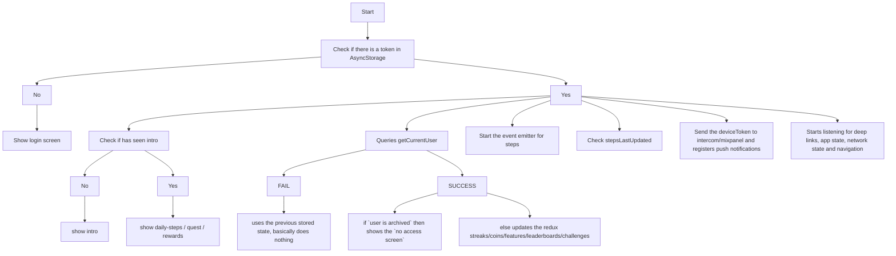

# yulife app

Source code for the React Native app for iOS and Android.

## Project Installation

### Node.js

The required version of Node.js is managed through [nvm](https://github.com/creationix/nvm). To ensure you're running the correct version of Node.js, follow the [nvm installation instructions](https://github.com/creationix/nvm#installation), then run the following command:

```sh
nvm use
```

### React Native

Follow the [React Native Installation Instructions](https://reactnative.dev/docs/environment-setup) for both iOS and Android targets, skipping the section that installs Node.js. This should guide you through the installation of the following required components:

- watchman
- react-native-cli
- XCode (v9.4 or newer)
- XCode Command Line Tools
- Java Development Kit (JDK 8)
- Android Studio
- Android SDK

If you are having trouble starting the apps, ensure you have followed the installation instructions correctly and have installed all of the necessary dependencies.

## Prepare app for building

### Install app dependencies

This project uses `yarn` for project tasks and dependencies.

Before you run `yarn` make sure you have added your [Gitlab token:](https://yulife.atlassian.net/wiki/spaces/ENGINEERIN/pages/1141833734/Engineering+setup+-+gitlab+access+tokens)

To install dependencies, run:

```sh
yarn
```

You'll also need to install iOS pods by running

```
cd ios && pod install && cd ../
```

If running `pod install` produces the error `SDK "iphoneos" cannot be located`, this means the XCode installation path is incorrect (it's probably installed under "Applications").

You can check this by running

```sh
sudo xcode-select --print-path
```

To update this path use

```su
sudo xcode-select --switch /Applications/Xcode.app
```

### Download Apollo Schema

This project uses Apollo/GraphQL for its backend communication.

To download the latest backend schema from the deployed API develop server, run:

```sh
yarn download:schema
```

Alternatively, if you are developing against a local instance of the API server, you can download its schema by running:

```sh
yarn download:schema:local
```

### Start bundler and TypeScript watch process

The Metro bundler and TypeScript watch process must be started before you can build and run either app. Start these with the following command:

```sh
yarn start
```

## Build app

### iOS

Building the app using XCode is the only way to install a development build on a physical device. If you only need to develop using the simulator you can use the command line.

### Building from command line (iOS)

Build and run the app in the default simulator by running the following command:

```sh
yarn start:ios
```

This will run under the default build profile, which will connect to the development API server. To choose a different build profile, add the profile name to the previous command, as below:

```sh
yarn start:ios:{profile}
# config = local | uat | production
```

#### Building from XCode

You should have installed XCode during the React Native installation process as described above.

The XCode project file can be opened either from within XCode or from Finder directly. It can be found:

```sh
<project directory>/ios/YuLife.xcodeproj
```

To build the app, select your preferred simulator target from the drop-down (this can include a physical device if one is connected) then press the Play button.

##### Build profiles (iOS)

Choose your build profile from the `Product -> Scheme` menu. By default, the `YuLife` profile is selected which connects to the develop API server. Alternate profiles available are `local`, which will connect to a local API instance, `uat` and `production`.

##### App signing

The app needs to be signed before it can be installed on a physical device.

- Ensure you've logged in to XCode using your Apple ID (`Preferences -> Accounts`). Your account needs to be linked to the `Yu Life Limited` team.

- Under the _General_ tab of `YuLife` build target, tick the `Automatically manage signing` option and select `Yu Life Limited` as your team.

### Android

### Building from command line (Android)

Ensure that the Java SDK (JDK) home path is set as an environment variable called `JAVA_HOME` for the shell used to start the Android build process. You can find the path out by running:

```sh
/usr/libexec/java_home -V | grep jdk
```

Build and run the app in the default simulator by running the following command:

```sh
yarn start:android
```

This will run under the default build profile, which will connect to the development API server. To choose a different build profile, add the profile name to the previous command, as below:

```sh
yarn start:android:{profile}
# config = local | uat | production
```

When you are testing against a local instance of the API, the Android emulator will attempt to connect via localhost. This actually refers to a service on the emulator itself so will not work. You will need to change
the `uri` used for `createHttpLink` in `src/components/graphql/_core/client.ts` to either be your local IP address or `10.0.2.2`, which refers to your machine. Don't forget to include the port.

**Using a physical device (Android)**

To run the app locally on a physical device, you need:

- Android 5.0 (Lollipop) or newer,
- USB debugging enabled (in Developer Settings),
- a USB connecting your mobile device to your computer.

Set the Android SDK as an environment variable called `ANDROID_HOME`. By default, this is `~/Library/Android/sdk`. This is required by the adb reverse proxy.

Once your device is connected, find your device name by running:

```sh
adb devices
```

Then, trigger a reverse proxy:

```sh
adb -s <device name> reverse tcp:8081 tcp:8081
```

You can then run `yarn start` and `yarn start:android` as above.

#### Building from Android Studio

You should have installed Android Studio during the React Native installation process as described above.

If you're opening Android Studio for the first time, select `Open and existing Android Studio project` from the Welcome screen and choose the following directory:

```sh
<project directory>/android
```

Wait patiently for the project to sync all of its dependencies. Once it's up-to-date, you can build the app by pressing the Play button from the top menu or selecting `Run -> Run 'app'` from the menu. At this point the ADB window will appear for you to select your deployment target. Either choose a connected phsyical device or any simulator you may have configured.

##### Build profiles (Android)

Choose your build profile from the `Build Profile` menu, which can be found as a vertical tab on the left side of Android Studio's window. By default, the `debug` profile is selected which connects to the develop API server. Alternate profiles available are `local`, which will connect to a local API instance, `uat` and `production`.

#### How to import Hardware Profiles to Android Studio

You will find all the `hardware-profiles` of the most android devices used by our users on `android-hardware-profiles`

Open `Android Studio` > `AVD Manager` > `Create Virtual Device Configuration` > `Import Hardware Profiles`

#### Google Account signing

In order to sign-in using a Google Account on your local development build, you need to link your local build to an OAuth client ID. To do this, you will first need to open the Android project in Android Studio which will generate a debug keystore for you. You will then need to extract the SHA-1 fingerprint from your debug certificate. To do this, run the following command:

```sh
keytool -list -v -keystore ~/.android/debug.keystore -alias androiddebugkey -storepass android -keypass android
```

The line that begins with SHA1 contains the certificate's SHA-1 fingerprint. The fingerprint is the sequence of 20 two-digit hexadecimal numbers separated by colons. For example:

```sh
SHA1: BB:0D:AC:74:D3:21:E1:43:07:71:9B:62:90:AF:A1:66:6E:44:5D:75
```

You will then need to request an OAuth 2.0 Client ID from the Google API Console.

1. Visit the [Google API Console](https://console.developers.google.com/flows/enableapi?apiid=fitness) page and create a new project.
2. Click **Continue** to enable to the Fitness API.
3. Click **Go to credentials**.
4. Click **New credentials**, then select **OAuth Client ID**.
5. Under Application type select `Android`.
6. In the resulting dialog, enter your app's SHA-1 fingerprint and package name. The package name for this project is **com.yulife.debug**

You may also be asked to create an OAuth Consent Screen. You only need to enter your email address and an example product name. Enter **yulife** for this value. You don't need to fill in any of the other fields.

You should now be able to log in to your Google Account in the simulator or device.

## Debugging

You can use the react native debugger.

Install it: `brew update && brew cask install react-native-debugger`

Run it with cmd-space or from launcher ("React Native Debugger").

Once running, press cmd-d in the emulator and select "Start remote JS debugging" from the menu.

## Releasing

### Test builds

To create a test build from a given commit, make a tag which starts `test-branch-` e.g.

```sh
git tag test-branch-my-new-feature-1
git push origin --tags
```

A tip is to append a number in case you will need more than one build per feature.

### Release Candidates

To create a release, branch or tag with a name such as `release/[major].[minor]` e.g. `release/1.9`.

To add bugfixes to an existing release just commit to that branch. No need to increment the version, the patch version automatically incrememnts with each build so the final version number will be something like `1.9.3214`.

Bitrise will automatically build the candidate and submit it to the appstores for the yulife engineering team. After testing in production we manually progress it to the whole company and finally the public.

## StoryBook

This project provides a StoryBook server. To access it, run the following `start` commands

To access the web version

```sh
yarn start:storybook:web
```

To access the app version

```sh
yarn start:storybook
```

## Folder Structure for YuLife

The YuLife project follows the [atomic design](http://atomicdesign.bradfrost.com/chapter-2/) pattern for component composition.

```sh
├── android
├── assets
├── ios
├── src
|   ├── components
|       ├── atoms
|           ├── component name
|               ├── component.styles.ts (CSS & Styles)
|               ├── component.helpers.tsx (Component helpers)
|               ├── component.tsx (Component)
|           ├── atoms.stories.tsx (Atom examples for StoryBook)
|       ├── containers (Container components only)
|           ├── container name
|               ├── component.container.ts
|               ├── component.helpers.ts
|       ├── modals (Components for use in modals only)
|       ├── molecules
|       ├── screens (Presentational components only)
|           ├── component name
|               ├── component.screen.data.tsx (Text strings used in component)
|               ├── component.screen.helpers.tsx
|               ├── component.screen.styles.ts
|               ├── component.screen.tsx
|   ├── context
|   ├── graphql
|   ├── navigation
|   ├── redux (configs, store, reducers, actions, etc.)
|   ├── services
|   ├── styles
├── storybook
```

## Custom ESLint Rules

We use ESLint and Prettier to enforce code style rules across the project. We use industry standard rules as created by AirBnB and React.
We can also use ESLint to create our own custom rules specific to our codebase. Some of the reason why we may want to do this include:

- Preventing the team from using deprecated fields/methods
- Enforcing repo-specific naming conventions for files/variables
- Help in planning and preparing ugrades and migrations

The custom ESLint rules are defined in the `yu-eslint/index.js` file. Define the rule inside of the `rules` object.

To enable your rule, you'll need to run `yarn add -D file:./yu-eslint` and to specify the rule inside of the `.eslintrc` file.

The rule should now display throughout the repo.

Note: One thing I've come across is often VSCode seems to cache the ESLint rules, so when they're changed and reinstalled they won't display automatically in the editor. I've found restarting VSCode solves this.

For those looking to create their own ESLint rules, here are some recommended materials:

- [Writing Rules: Medium Article](https://flexport.engineering/writing-custom-lint-rules-for-your-picky-developers-67732afa1803)
- [Official Docs](https://eslint.org/docs/developer-guide/working-with-rules)
- [AST Explorer](https://astexplorer.net/)

## Gotchas

### Disappearing packages

Problem: `yarn add some-package -D` deletes git dependencies in package.json.
Solution: Re-run `yarn add` after

## flow

### on start



- Check if there is a `token` in `AsyncStorage`
  - NO
    - Show [login screen](#login)
  - YES
    - Check if has seen intro
      - NO: show `intro`
      - YES: show [daily-steps](#daily-steps) / [quest](#quest) / [rewards](#rewards)
    - Queries `getCurrentUser`
      - FAIL: uses the previous stored state (basically does nothing)
      - SUCCESS
        - if `user is archived` then shows the `no access screen`
        - else updates the redux (streaks/coins/user(features/leaderboards...)/challenges)
    - Start `the event emitter for steps`
    - Check `stepsLastUpdated`
      - `if < today` then get the previous days steps and send it to server (tries to send the result until it succeds)
      - `else` do nothing
    - Send the `deviceToken` to intercom/mixpanel and registers push notifications
    - Starts listening for `deep links`, `app state`, `network state` and `navigation`

### login

- on submit
  - FAIL: show the error message
  - SUCCESS
    - store the token to AsyncStorage
    - populate redux with latest user data
    - Check if has seen intro
      - NO: show `intro`
      - YES: show [daily-steps](#daily-steps) / [quest](#quest) / [rewards](#rewards)

### daily-steps

- TODO

### quest

- on mount
  - `if offline`: shows offline quest screen
  - queries `getCurrentWorld`
    - if request failed: ????? (renders cached data)
    - render new rewards list and cache them

### rewards

- on mount
  - `if offline`: shows cached rewards (if no cached results we're f#^&\*d !? LOLWAT)
  - Queries `getRewards`
    - if request failed: show cached rewards
    - render new rewards list and cache them

## Detox

On `rn-client`, open 2 terminals

- `start:e2e`
- `detox:smoke` or `detox:extended`

On `api-server`

- `detox:start`

### Gotchas

- If `detox:build` fails with the `package was built for iOS not iOS Simulator` error, change detox build step in `package.json` to:

```
"build": "xcodebuild -workspace ios/YuLife.xcworkspace -scheme local -configuration Debug -sdk iphonesimulator -derivedDataPath ios/build EXCLUDED_ARCHS=arm64",
```

## Garmin Sync

Trying to sync Garmin? On `api-server`, do `yarn develop:develop` before trying to toggle Garmin sync.
