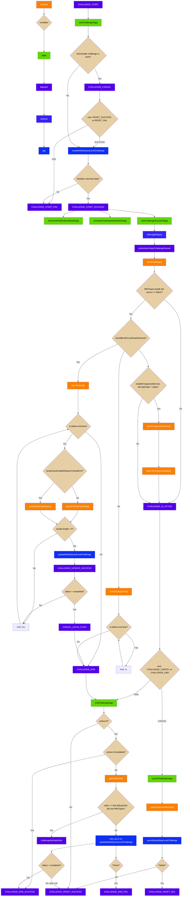

# Challenge tracking flow

This graph explains the flow of a challenge and how user steps/meditation is kept in sync when doing a challenge.

```mermaid
graph TD
    classDef condition fill:#E7CFA5,color:black
    classDef saga fill:#61d800,color:black
    classDef dispatch fill:#5300e8,color:white
    classDef function fill:#fa8100,color:white
    classDef selector fill:#3722f6,color:white
    classDef gql fill:#0f2ff6,color:white

    legendFn[function]:::function --> legendCond{condition}:::condition --> legendSaga[saga]:::saga --> legendDispatch[dispatch]:::dispatch --> legendSel[selector]:::selector --> legendGql[gql]:::gql

    CHALLENGE_START[CHALLENGE_START]:::dispatch --> startChallengeSaga:::saga
    startChallengeSaga --> hasActive{"Active/stale challenge in store?"}:::condition
    hasActive -->|Yes| CHALLENGE_CANCEL[CHALLENGE_CANCEL]:::dispatch
    CHALLENGE_CANCEL --> raceReset{"race: RESET_SUCCESS vs RESET_FAIL"}:::condition
    raceReset -->|FAIL| CHALLENGE_START_FAIL[CHALLENGE_START_FAIL]:::dispatch
    raceReset -->|SUCCESS| createMutation["createMobileQuestLevelChallenge"]:::gql
    hasActive -->|No| createMutation
    createMutation --> mutationOk{"Mutation returned data?"}:::condition
    mutationOk -->|No| CHALLENGE_START_FAIL
    mutationOk -->|Yes| CHALLENGE_START_SUCCESS[CHALLENGE_START_SUCCESS]:::dispatch

    CHALLENGE_START_SUCCESS --> showPushNotificationModalSaga:::saga
    CHALLENGE_START_SUCCESS --> scheduleChallengeNotificationSaga:::saga
    CHALLENGE_START_SUCCESS --> startChallengeSuccessSaga:::saga

    startChallengeSuccessSaga --> getSteps["select(getSteps)"]:::selector
    getSteps --> CHALLENGE_START_INITIAL_STEPS[pedometerStepsChallengeStarted]:::dispatch
    CHALLENGE_START_INITIAL_STEPS --> startChallenge["startChallenge()"]:::function

    startChallenge --> hasFitkit{"fitKitTypes.length && source != Watch?"}:::condition
    hasFitkit -->|No| CHALLENGE_IS_ACTIVE[CHALLENGE_IS_ACTIVE]:::dispatch
    hasFitkit -->|Yes| shouldEndOnLastGoal{"shouldEndOnLastGoalAchieved?"}:::condition
    shouldEndOnLastGoal -->|Yes| startTracking["startTracking()"]:::function
    shouldEndOnLastGoal -->|No| startTrackingTime["startTrackingTime()"]:::function
    shouldEndOnLastGoal --> fgServiceEnabled{"enableForegroundService && dataType = steps?"}:::condition
    fgServiceEnabled -->|Yes| startForegroundService["startForegroundService()"]:::function
    startForegroundService --> listenToForegroundSteps["listenToForegroundSteps()"]:::function
    listenToForegroundSteps --> CHALLENGE_IS_ACTIVE
    fgServiceEnabled -->|No| CHALLENGE_IS_ACTIVE

    startTracking --> IsBeforeEndTime{"Is before end time?"}:::condition
    IsBeforeEndTime -->|No| CHALLENGE_END[CHALLENGE_END]:::dispatch
    IsBeforeEndTime -->|Yes| v4Feature{"tempGameEnableReleaseYuHealthV4?"}:::condition
    v4Feature -->|No| queryFitKitSampleData["queryFitKitSampleData()"]:::function
    v4Feature -->|Yes| yuHealthSampleQuery["yuHealthSampleQuery()"]:::function
    queryFitKitSampleData --> hasData{"results.length > 0?"}:::condition
    yuHealthSampleQuery --> hasData
    hasData -->|No| Wait15[Wait 15s] --> IsBeforeEndTime
    hasData -->|Yes| updateMobileQuestLevelChallenge["updateMobileQuestLevelChallenge"]:::gql
    updateMobileQuestLevelChallenge --> CHALLENGE_UPDATE_SUCCESS[CHALLENGE_UPDATE_SUCCESS]:::dispatch
    CHALLENGE_UPDATE_SUCCESS --> statusCompleted{"status = completed?"}:::condition
    statusCompleted -->|No| Wait15
    statusCompleted -->|Yes| CANCEL_LOCAL_PUSH[CANCEL_LOCAL_PUSH]:::dispatch
    CANCEL_LOCAL_PUSH --> CHALLENGE_END

    startTrackingTime --> isBeforeTimeTrackEnd{"Is before end time?"}:::condition
    isBeforeTimeTrackEnd -->|Yes| Wait1s[Wait 1s] --> isBeforeTimeTrackEnd
    isBeforeTimeTrackEnd -->|No| CHALLENGE_END

    CHALLENGE_IS_ACTIVE --> raceCancelEnd{"race: CHALLENGE_CANCEL vs CHALLENGE_END"}:::condition
    raceCancelEnd -->|CANCEL| cancelChallengeSaga:::saga
    cancelChallengeSaga --> stopFgService["stopForegroundService()"]:::function
    stopFgService --> cancelMutation["cancelQuestMapLevelChallenge"]:::gql
    cancelMutation --> cancelFailed{"Failed?"}:::condition
    cancelFailed -->|Yes| CHALLENGE_RESET_FAIL[CHALLENGE_RESET_FAIL]:::dispatch
    cancelFailed -->|No| CHALLENGE_RESET_SUCCESS[CHALLENGE_RESET_SUCCESS]:::dispatch

    raceCancelEnd -->|END| endChallengeSaga:::saga
    CHALLENGE_END --> endChallengeSaga
    endChallengeSaga --> hasActiveId{"active.id?"}:::condition
    hasActiveId -->|No| CHALLENGE_RESET_SUCCESS
    hasActiveId -->|Yes| isAlreadyComplete{"active.isCompleted?"}:::condition
    isAlreadyComplete -->|Yes| CHALLENGE_END_SUCCESS[CHALLENGE_END_SUCCESS]:::dispatch
    isAlreadyComplete -->|No| getEndResult["getEndResult()"]:::function
    getEndResult --> emptyResultDefer{"value = 0 && debugTools && has fitKitTypes?"}:::condition
    emptyResultDefer -->|Yes| CHALLENGE_NO_DATA_DEFER[challengeNoDataDefer]:::dispatch
    emptyResultDefer -->|No| retryLoop["retry up to 5x:<br/>updateMobileQuestLevelChallenge"]:::gql
    retryLoop --> completedAfterRetries{"status = completed?"}:::condition
    completedAfterRetries -->|Yes| CHALLENGE_END_SUCCESS
    completedAfterRetries -->|No, data null| CHALLENGE_RESET_SUCCESS
    retryLoop --> threw{"Threw?"}:::condition
    threw -->|Yes| CHALLENGE_END_FAIL[CHALLENGE_END_FAIL]:::dispatch
```
