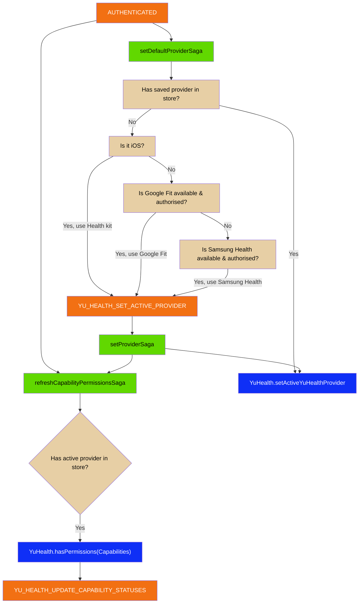

# Yu Health Redux diagram

```mermaid
graph TD
    classDef condition fill:#E7CFA5,color:black
    classDef saga fill:#61d800,color:black
    classDef action fill:#f27013,color:white
    classDef function fill:#fa8100,color:white
    classDef selector fill:#3722f6,color:white
    classDef native fill:#0f2ff6,color:white

    AUTHENTICATED:::action
    AUTHENTICATED --> refreshCapabilityPermissionsSaga:::saga

    AUTHENTICATED --> setDefaultProviderSaga:::saga

    setDefaultProviderSaga --> hasSavedProvider["Has saved provider in store?"]:::condition --> |Yes| nativeSetActiveYuHealthProvider["YuHealth.setActiveYuHealthProvider"]:::native
    hasSavedProvider --> |No| isIos["Is it iOS?"]:::condition --> |Yes, use Health kit| setActiveYuHealthProvider

    setActiveYuHealthProvider["YU_HEALTH_SET_ACTIVE_PROVIDER"]:::action --> setProviderSaga:::saga --> nativeSetActiveYuHealthProvider
    setProviderSaga --> refreshCapabilityPermissionsSaga
    isIos --> |No|isGoogleFitAvailable["Is Google Fit available & authorised?"]:::condition --> |Yes, use Google Fit|setActiveYuHealthProvider
    isGoogleFitAvailable --> |No|isSamsungHealthAvailable["Is Samsung Health available & authorised?"]:::condition --> |Yes, use Samsung Health|setActiveYuHealthProvider
    refreshCapabilityPermissionsSaga --> hasActiveProvider{Has active provider in store?}:::condition
    hasActiveProvider --> |Yes| yuHealthHasPermissions["YuHealth.hasPermissions(Capabilities)"]:::native
    --> YU_HEALTH_UPDATE_CAPABILITY_STATUSES:::action
```
